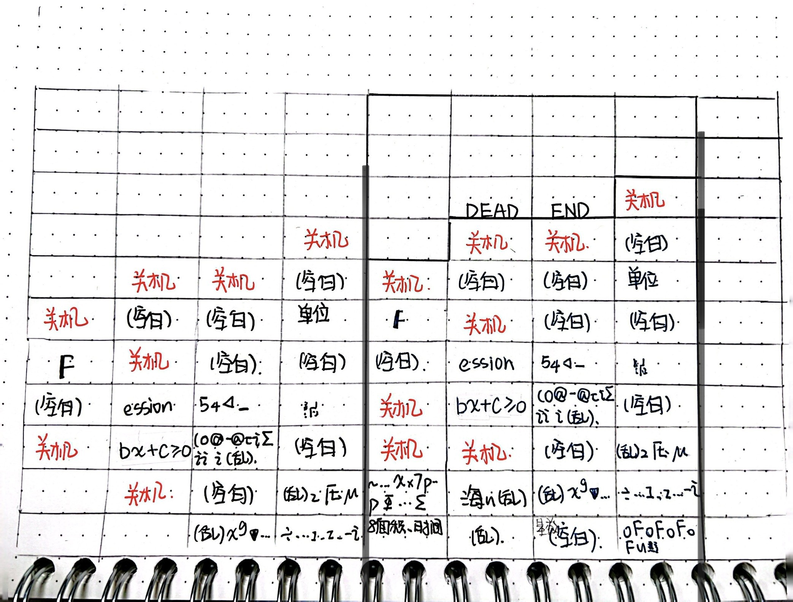
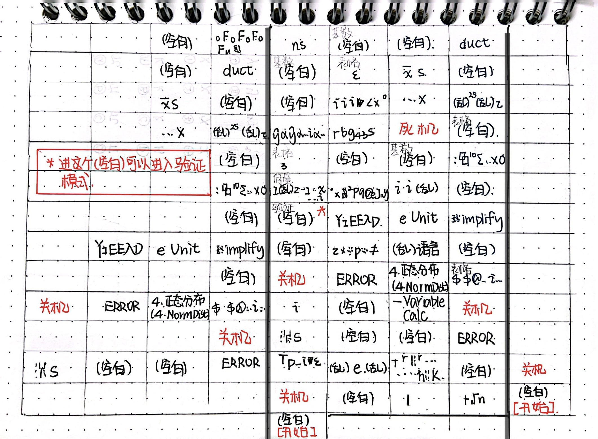
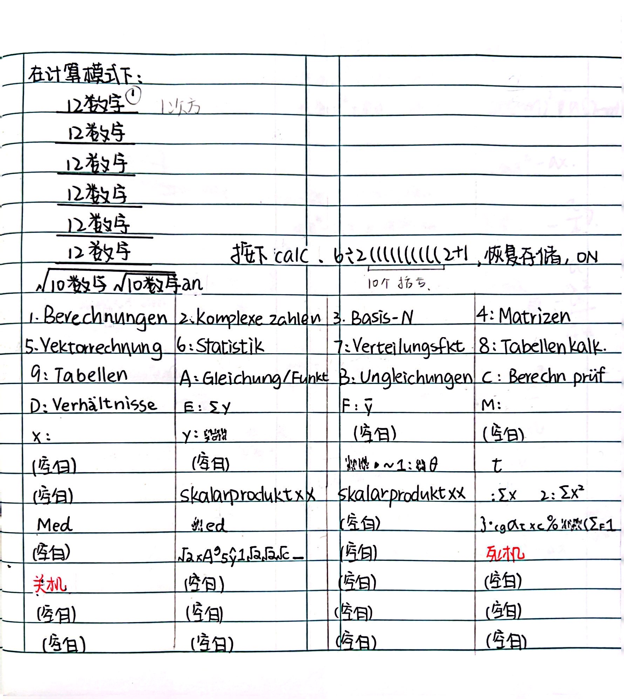
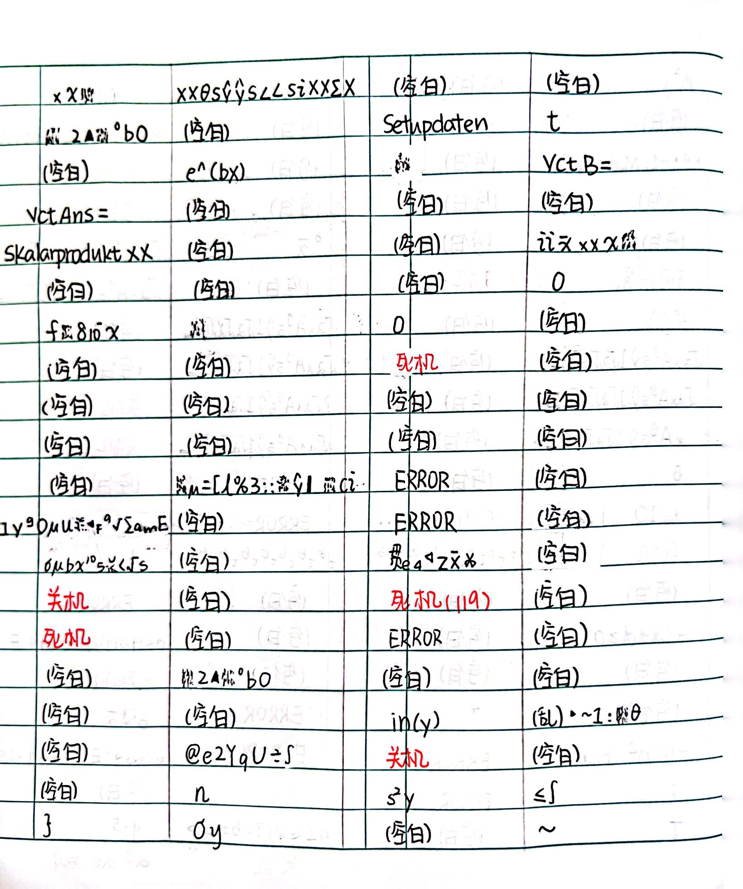
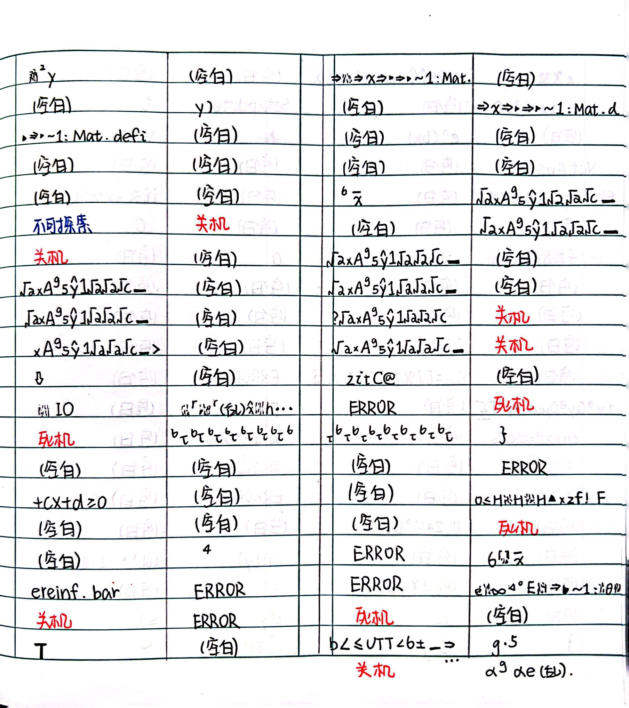

# an的种种用法

--- 

整合：狼太(ookamitai)

---

## 超大异常菜单 (CN X)

[参考文档](http://tieba.baidu.com/p/8136027660)

刷`an`，然后输入

$$ \frac{\frac{\frac{\frac{\frac{\frac{5数字}{10数字} }{15数字} }{20数字} }{25数字} }{30数字} }{\sqrt{7数字\sqrt{7数字\sqrt{27数字} } } \mathbf{an} }  $$  

然后刷框，按下等于报错

然后`(SHIFT)` `9` `2`，复位计算器（此时屏幕到达极低对比度），按下`ON`

此时按`菜单`，出现了异常菜单

**注：从下往上，黑框内是绝对位置，外部是相对位置**

## 超大异常菜单 (DE X)

自己整的

