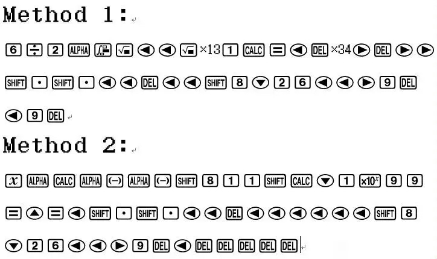
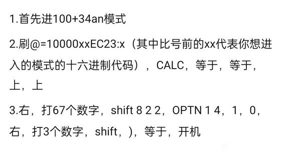
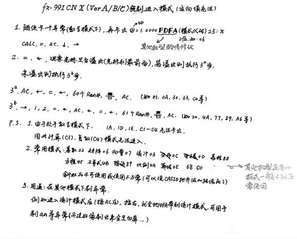
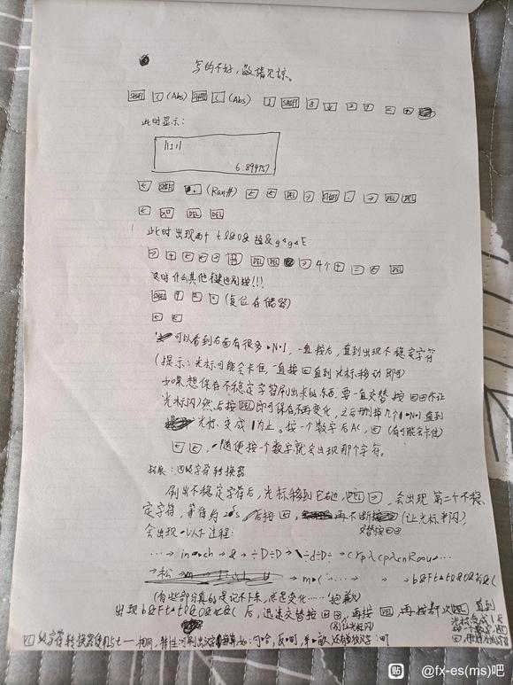
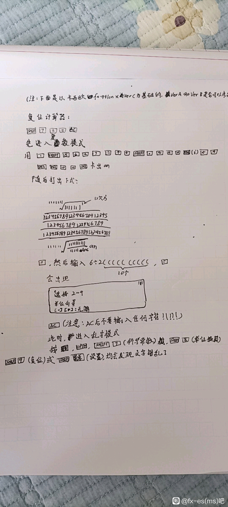

# 有关于 Casio fx-991CNX 漏洞的存档

---

整合：狼太 (ookamitai)

因为网络上有关于 991 的文档确实很杂乱，所以打算整理&保存一下历史。

---

## 术语说明

[参考文档 1](https://zhuanlan.zhihu.com/p/261156688)

### VerA、B、C

- 同时按住`SHIFT` `7` `开机(ON)`
  - 出现`DIAGNOSTIC` `Press AC`
- 按下`9`
  - 出现`888888888888888` `8.888888889x10^15`
- 5 下`SHIFT`
  - 出现`CY-239` `VerA` \ `VerB` \ `VerC`
  - (如果不是`CY-239`考虑可能是盗版机器)

### 119

指刷机后按开机键恢复不了的状况
如果别人告诉你这个刷机公式会 119 的话，尽量不要尝试
如果你的计算器 119 了，解决办法很简单：拆电池，再过 10 分钟装上即可恢复原状（最好盖住太阳能板）

### 68 模式

68 模式指的是开机后保留历史记录的模式

（FUN FACT：其实是一种特殊的计算器模式，考虑为什么方程模式开机可以保存参数！）

### x+y an 模式

- 进入线性模式，打出：

$$ x=\sum (x, 1, 100 $$

- `CALC` `AC` `左` `DEL` `DEL` `CALC` `=`
- `左` `Ran#` `Ran#` `左` `左` `DEL` `下`  
  (也就是下面的 **线性 SIGMA 溢出** )
- `SHIFT` `8` `下` `2` `6` `左` `左` `右`
- `9` `DEL` `左` 屏幕出现：

$$ x=\sum (x, 1, 1an$$

然后完善这个式子成：

$$ x = \sum (x, 1, 1) + x 个数字 + y 个数字 an $$

按下 `CALC` `=` 即可

## 各种溢出

[参考文档 1](https://tieba.baidu.com/p/3810670052)  
[参考文档 2](https://zhuanlan.zhihu.com/p/261156688)  
[参考文档 3](https://zhuanlan.zhihu.com/p/464012892)  
[参考文档 4](https://tieba.baidu.com/p/8169722614)

### 压力 BUG（字符转换器 / LBF 转换器）

- `SHIFT` `9` `3` `=` `AC` 复位计算器（可选）
- `1` `SHIFT` `8` `下` `2` `7` `=`
- `上` `左`

### 刷框

- `SHIFT` `9` `3` `=` `AC` 复位计算器（可选）

在计算器内输入：

$$ 6{\div} 2((2+1\sqrt{\sqrt{\sqrt{\sqrt{\sqrt{\sqrt{\sqrt{\sqrt{\sqrt{\sqrt{\sqrt{\sqrt{1} } } } } } } } } } } }: \sqrt{\Box} $$

- `6` `÷` `2` `(` `(` `2` `+` `1`
- 根号打到 **按不动** 为止，输入`1`
- `ALPHA` `积分` (`:`)
- `根号`

然后：

- `=` （VerC 按`CALC`）
- `=` `左` `右` `DEL` `左`
- 删完，只剩下一个框

### 线性 SIGMA 溢出

- `SHIFT` `菜单(MENU)` `1` `3` 进入线性模式

打出：

$$ x=\sum (x, 1, 100 $$

- `x` `ALPHA` `CALC`
- `SHIFT` `x` (SIGMA)
- `x` `SHIFT` `)` `1` `SHIFT` `)` `100`

然后：

- `CALC` `AC` `左` `DEL` `DEL` `CALC` `=` 此时报错
- `左` `SHIFT` `·` `SHIFT` `·` `左` `左` `DEL` `下`

### A99

- 给 A 赋值 10^99，然后输入:

$$ x = AAcm\to in $$

- `SOLVE` `SHIFT` `·` `SHIFT` `·` `左` `左` `DEL`

## 刷字符

[参考文档 1](https://tieba.baidu.com/p/3810670052)  
[参考文档 2](https://zhuanlan.zhihu.com/p/261156688)  
[参考文档 3](https://zhuanlan.zhihu.com/p/464012892)  
[参考文档 4](https://tieba.baidu.com/p/8169722614)

### 刷`an`

**VerA / B / C**

- 计算模式：

  - 进入字符转换器
  - `SHIFT` `8` `下` `2` `6`
    - 出现`1Unknowi`
  - `左` `左` `右`
    - 光标卡在`Unknow`与`i`之间
  - `9` `左` `SHIFT` `·`
  - `左` `左` `右` `SHIFT` `·`
  - `右` `右`
  - `DEL` `DEL` `DEL`
  - `右` `左` `9`
  - `DEL` `DEL`
    - 屏幕只剩下`an`

- 复数模式：
  - 进入字符转换器
  - `SHIFT` `·`
  - `左` `左` `右`
  - `ENG (i)`
  - `左` `9`
  - `DEL` `DEL`
    - 屏幕只剩下`an`

**VerF**

图 by 贴吧大佬 [@pyridnephenol](https://tieba.baidu.com/home/main?id=tb.1.96303922.8s1lnkVa10MeKccPfcpLLA)

`an` 有很多用法，所以单独做了一页

[an 的种种用法](an.md)

### 刷变量`$`

- 进入字符转换器
- `SHIFT` `8` `下` `2` `8`
- `左` `左` `右`
- `DEL` `DEL`
  - 屏幕剩下`$`

但是`$`有什么用呢？

**当然是恶搞别人计算器啦！**

- 刷两个`$`，并格式成这样
  如图：

$$ \frac{$}{$}^2 $$

- 按`=`
- 把`$`赋值给`x`
  - 此时计算器死机，按`ON`
- 进入方程模式
- 在参数内填入`x`
- `ON`
- 计算器死机

**解决方法：进入自检再退出即可**

### 刷变量`@(4F)`

**有很多`@`，各个`@`性质都有所不同，这只是其中一个**  
**可以参见[字符表](conv.md)**

- 进入字符转换器
- `SHIFT` `7` `1` `4`
- `左` `左` `右`
- `DEL` `DEL`
  - 屏幕剩下`@`

### 刷任意字符

- 用任意溢出方法溢出后，在 FE FD 处打 `SHIFT` `7` `4` `8` 刷出`@(4D)`，打：

$$ @=1.0000\Box \Box \Box \Box \Box \Box \Box \Box 23:x $$

（其他框表示 0-F 任意十六进制数，如

$$ @=1.0000D035363823:x $$

）

- `CALC` `=` `=` `下`
- 就出现想要的字符啦

**可以参见[字符表](conv.md)**  
**注：第 7、8 位的框必须小于 9A，否则卡不出来**

## 进入任意模式

[参考文档 1](https://tieba.baidu.com/p/8169722614)

### 方法 1（线性）

发现者 [@-Wind°](https://tieba.baidu.com/home/main?id=tb.1.58f72a67.Scv9V6JNveNkP2g6qGcpfg)

**注：格式为**

$$ 67 数字\:m^{2}\to acre\:sinh-1(\:1\:0\:xx 字符\:3 个数字\:逗号\:EC 字符 $$

**最后按等于后报错是正常现象，按开机后就进入你想要的模式了**

### 方法 2（数学）

发现者 [@pyridnephenol](https://tieba.baidu.com/home/main?id=tb.1.96303922.8s1lnkVa10MeKccPfcpLLA)

**第一步的`@`是 4D**

**如果 3a 3b 法都无法溢出，可以试试 1 FDFA 字符 1 xx 字符进模式后，shift 灯会亮，再按一次 shift 再按 AC，否则会关机**

## 不稳定字符

[参考文档 1](http://tieba.baidu.com/p/7552673235)

## 乱字模式

[参考文档 1](https://tieba.baidu.com/p/8204531189)  
[参考文档 2](https://tieba.baidu.com/p/7496761778)  

**注：乱字有很多方式，只列出几个比较稳定的**

### 第一种

- 刷出 **FDFE** 字符后面跟`@(SHIFT811) X`，其中 X 是单字节字符
- `=` `左` `AC` `左` `=` `左`
- 48 下`Ran#` `分数线` `AC`

### 第二种

## 修改光标

[参考文档 1](ttps://tieba.baidu.com/p/8204531189)

- 卡出 `@=1.0000FDFA··0E23:x` `CALC` `=` `AC` `↓` `→`（@为4D）
- `8` `=` `←` `AC` `←` `=` `←`
- 44`Ran#` `分数线`

**··内填写光标显示的字符对应16进制编码**

