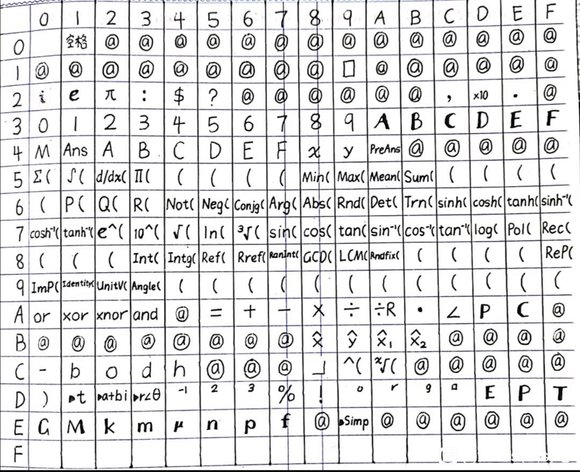
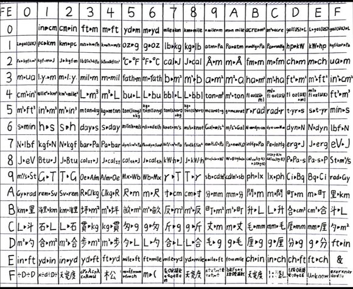
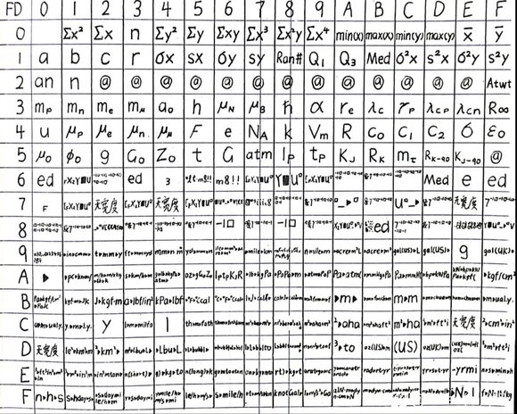
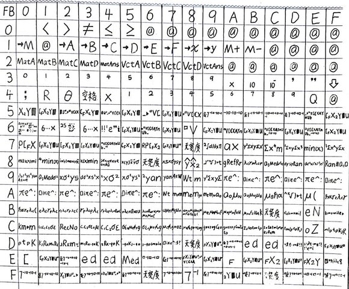
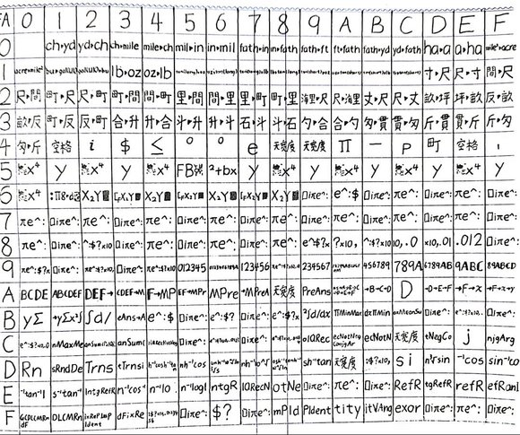

# fx-991CNX 字符表

---

[原网站](https://tieba.baidu.com/p/7126603316)  
[原作者 @qctnontcq](https://tieba.baidu.com/home/main?id=tb.1.e0031f51.z9RvXDMP-Sm70nhmdxX7nw)

---

## 单字节字符表

例如，数字 0 对应的字符是 30

## FE 双字节字符表

## FD 双字节字符表

**E3 和 E7，E4 和 E6 反了**

## FB 双字节字符表

**E3 和 E7，E4 和 E6 反了**

## FA 双字节字符表

