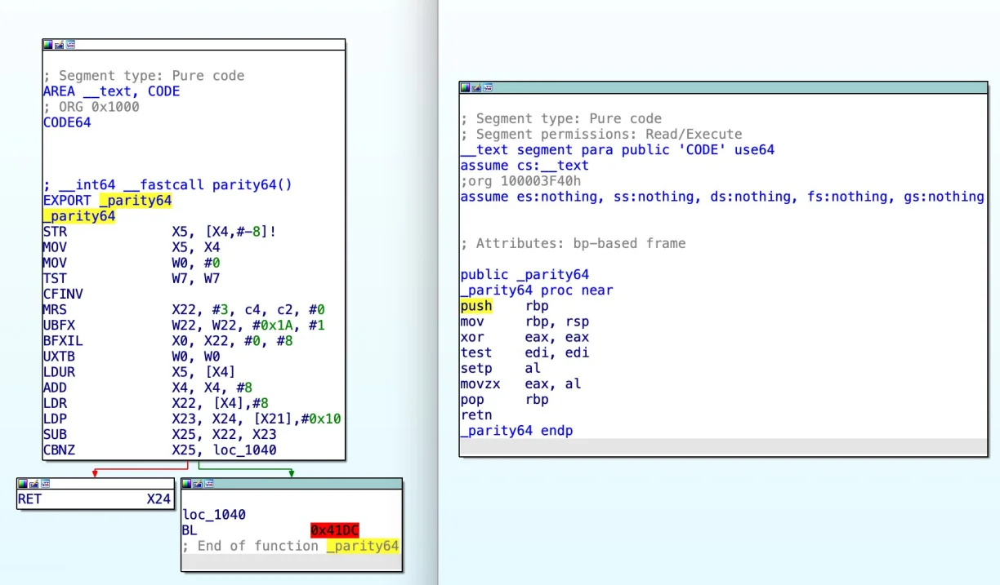

# Rosetta 2为何如此之快?

---
翻译：狼太 (ookamitai)  
原文作者：[dougallj](https://dougallj.wordpress.com/2022/11/09/why-is-rosetta-2-fast/)  
---

Rosetta 2与其他x86转ARM模拟器相比较是非同寻常的快速的。出于一些剩余的好奇心，我花了一点点时间来看看它是如何实现的，并且发现它确实很不同，所以我打算把自己的发现整理成笔记。

我的理解有些粗糙，而且大部分是基于阅读提前翻译好的代码，然后从中进行推理。如果有任何修正，或者其他的一些小技巧，请让我知道！

⬆️ IDA Pro 屏幕截图：Rosetta 2提前代码和原始x86代码的并排比较，对于错误命名为 `parity64` 的函数，该函数使用x86奇偶校验标志计算8位奇偶校验参数 。

## 提前翻译

Rosetta 2提前把整个二进制的 `text` 部分从 x86 翻译至 arm。它同时还支持 `just-in-time (JIT)` 翻译，但是这相对用到的很少，避免着编译时的运行开销和任何不直接的指令和数据缓存。

其他解释器通常按执行顺序翻译代码，这可以加快启动时间，但不会保留代码局部性。

## 通常是一对一翻译

*（更正：这篇文章的早期版本表示，每条提前翻译的指令都是一个有效的入口点。 虽然我仍然相信跳转到几乎任何提前翻译的指令都是有效的，但所使用的查找表不允许这样做。 我相信这是一种保持较小查找大小的优化。 在本文的初始版本之后还发现了序言/尾声优化。）*

每条 x86 指令在提前二进制文件中都会被转换为一个或多个 ARM 指令（`NOP` 除外，它会被忽略）。当间接跳转或调用将指令指针设置为文本段中的任意偏移量时，运行时将查找相应的翻译指令，并在那里分支。

这使用 x86 到 ARM 查找表，其中包含所有函数启动以及其他未引用的基本块。 如果它错过了这一点，例如在处理 `switch` 语句时，它可能会回退到 `JIT`。

为了实现精确的异常处理、采样分析和附加调试器，Rosetta 2 维护从翻译后的 ARM 指令到其原始 x86 地址的映射，并保证每条指令之间的状态是规范的。

这几乎完全阻止了指令间的优化。有两个已知的例外情况 第一个是“未使用标志”优化，如果在标志设置指令的每个路径上被覆盖之前未使用它们，则可以避免计算 x86 标志值。另一种结合了函数序言和结尾，结合了入栈和出栈指令以及延迟堆栈指针的更新。在 ARM 到 x86 地址映射中，它们看起来就像是一条指令。

为了保持每条指令之间的状态规范，需要进行一些权衡：

- 要么所有模拟寄存器值必须保存在主机寄存器中，要么每次使用某些寄存器时都需要加载或存储指令。64 位 x86 的寄存器数量是 64 位 ARM 的一半，因此这对于 Rosetta 2 来说不是问题，但对于在 x86 上模拟 64 位 ARM 或在 64 位 ARM 上模拟 PPC 的技术来说，这将是一个重大缺陷。

- 指令间优化非常少，导致在某些情况下生成的代码非常糟糕。然而，一般来说，代码已经由 x86 的优化编译器生成，因此许多优化的好处将受到限制。

但是这也有显著的好处：

- 通常，仅翻译每条指令一次具有显着的指令缓存优势——其他模拟器在分支到新目标时通常无法重用代码。
  
- 精确的异常，不需要存储比指令边界更多的信息。

- 调试器 (`LLDB`) 使用 x86 二进制文件，并且可以附加到 Rosetta 2 进程。

- 更少的优化可以简化代码生成，从而加快翻译速度。 翻译速度对于首次启动时间（可能翻译数十兆字节的代码）和 `JIT` 翻译时间都很重要，后者对于使用 `JIT` 编译器的应用程序的性能至关重要。

优化指令缓存可能看起来不是一个显着的好处，但它通常是在模拟器中，因为在指令集之间转换时已经有一个膨胀系数。每个一字节 x86 推送都会变成一个四字节 ARM 指令，每个读-改-写 x86 指令都是三个 ARM 指令（或更多，取决于寻找地址的模式），而且那是有完美的指令的话。当指令的语义略有不同时，甚至需要更多指令才能获得所需的行为。

考虑到这些限制，目标通常是尽可能接近每 x86 指令一条 ARM 指令，并且以下各节中描述的技巧使 Rosetta 能够经常实现这一目标。这使得膨胀系数尽可能低。例如，`sqlite3` 二进制文件的指令大小膨胀系数约为 1.64 倍（x86 指令为 1.05MB，ARM 指令为 1.72MB）。

（这两个查找（一个从 x86 到 ARM，另一个从 ARM 到 x86）是通过 `LC_AOT_METADATA` 中的片段列表找到的。分支目标结果缓存在哈希映射中。可以使用各种结构来实现这些查找，但在一个二进制中性能关键的 x86 到 ARM 映射使用两级二分搜索，而规模更大、性能要求较低的 ARM 到 x86 映射则使用顶级二分搜索，然后对位打包数据进行线性扫描。 ）

---
真难翻译，再加上我是菜狗（  
今天先写到这里

*to be continued...*