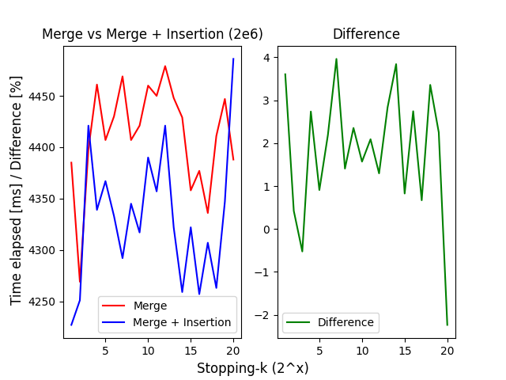
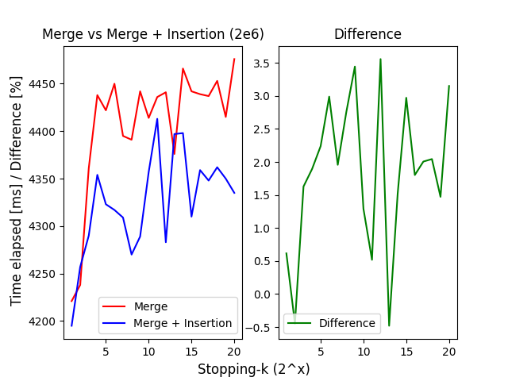
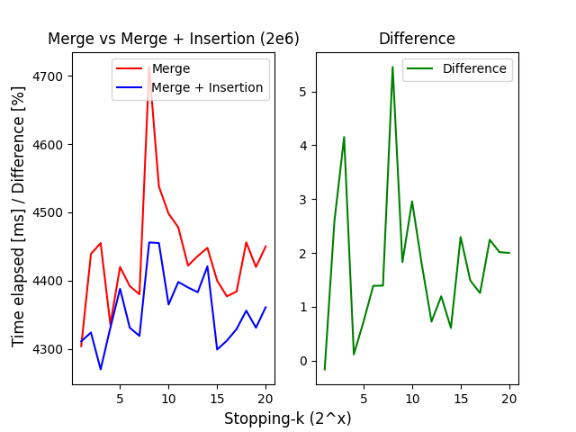

# 对 Merge Sort 算法的优化

_注：灵感来源：《算法导论 (3rd Edition)》思考题 2-1_

---

Merge Sort 的最坏情况运行时间为 _`O(nlgn)`_，而 Insertion Sort 的最坏情况运行时间为 _`O(n^2)`_ 。

**但是**， 插入排序的常量的比例系数使它在 _`n`_ 很小的时候在实际运行的时候更快。

考虑以下代码：

``` C++
void merge_sort_recursion(std::vector<int>& v, int p, int r) {
    if (p < r) {
        int q = (p + r) / 2;
        merge_sort_recursion(v, p, q);
        merge_sort_recursion(v, q + 1, r);
        merge(v, p, q, r);
    }
    return;
}
```

_(其中数组 `v` 的待排序部分是 `[p..r]`)_

对其如此修改：

``` C++
void merge_insertion_sort_recursion(std::vector<int>& v, int p, int r, int stopping_k) {
    if (p < r) {
        int q = (p + r) / 2;
        if (v.size() <= stopping_k) {
            insertion_sort(v);
        } else {
            merge_sort_recursion(v, p, q);
            merge_sort_recursion(v, q + 1, r);
            merge(v, p, q, r);
        }
    }
    return;
}
```

即当数组 `v` 的大小小于等于设定的切换值 `stopping_k` 时，切换到 Insertion Sort。

通过代码实践可得：





**但是，问题又来了——**

我们应该如何选择 `stopping_k` 呢？

_[to be continued...]_

附：大便参考代码

``` C++
// merge_insertion.cpp - A program to find the optimal k to switch to insertion sort
// Created on: May 11, 2024 18:54

#include <iostream>
#include <vector>
#include <string>
#include <cstdlib>
#include <ctime>
#include <chrono>

typedef std::vector<int> num_array;

// a timer utility
typedef class Timer {
private:
    std::chrono::steady_clock::time_point start;
public:
    void reset() {
        using namespace std::chrono;
        start = steady_clock::now();
    }
    int get_duration() {
        using namespace std::chrono;
        steady_clock::time_point end = steady_clock::now();
        return duration_cast<milliseconds>(end - start).count();
    }
    Timer() {
        using namespace std::chrono;
        start = steady_clock::now();
    }
} Timer;

// code for generating an array
num_array generate_array(int num, int upper = 100) {
    num_array v;
    for (int i = 0; i < num; i++) {
        v.push_back(rand() % upper + 1);
    }
    return v;
}

num_array generate_array(int num, int lower, int upper) {
    num_array v;
    for (int i = 0; i < num; i++) {
        v.push_back(rand() % (upper - lower + 1) + lower);
    }
    return v;
}

void insertion_sort(num_array& v) {
    // simple insertion sort
    int key, i;
    for (int j = 1; j < v.size(); j++) {
        key = v[j];
        i = j - 1;
        while (v[i] > key && i >= 0) {
            v[i + 1] = v[i];
            i = i - 1;
        }
        v[i + 1] = key;
    }
}

void merge(num_array& v, int p, int q, int r) {
    num_array L, R;
    // split the array in range [p..r] into [p..q] and [q+1..r]
    for (int i = p; i <= q; i++) L.push_back(v[i]);
    for (int i = q + 1; i <= r; i++) R.push_back(v[i]);
    L.push_back(INT_MAX); R.push_back(INT_MAX);

    // we cannot ensure L and R has the same number of elements
    int i = 0, j = 0;
    for (int k = p; k <= r; k++) {
        if (L[i] <= R[j]) {
            v[k] = L[i];
            i++;
        } else {
            v[k] = R[j];
            j++;
        }
    }
    return;
}

void merge_sort_recursion(num_array& v, int p, int r) {
    if (p < r) {
        int q = (p + r) / 2;
        merge_sort_recursion(v, p, q);
        merge_sort_recursion(v, q + 1, r);
        merge(v, p, q, r);
    }
    return;
}

void merge_sort(num_array& v) {
    merge_sort_recursion(v, 0, v.size() - 1);
    return;
}

void merge_insertion_sort_recursion(num_array& v, int p, int r, int stopping_k) {
    if (p < r) {
        int q = (p + r) / 2;
        if (v.size() <= stopping_k) {
            insertion_sort(v);
        } else {
            merge_sort_recursion(v, p, q);
            merge_sort_recursion(v, q + 1, r);
            merge(v, p, q, r);
        }
    }
    return;
}

void merge_insertion_sort(num_array& v, int stopping_k = 4) {
    merge_insertion_sort_recursion(v, 0, v.size() - 1, stopping_k);
    return;
}

int main(int argc, char* argv[]) {
    srand(time(nullptr));
    // declare vars
    num_array a;
    Timer t;
    int stopping_k, size;
    // init
    if (argc != 3) {
        std::cout << "Usage: merge_insertion [sample_size_exponent] [stopping_k]\n";
        return 1;
    } else {
        try {
            size = pow(2, std::stoi(argv[2]));
        } catch (const std::exception& e) {
            size = 32,768;
        }
        try {
            stopping_k = std::stoi(argv[2]);
        } catch (const std::exception& e) {
            stopping_k = 16;
        }
    }
    // output info and then sort
    std::cout << "sample array size: " << size << std::endl;
    a = generate_array(size);

    std::cout << "insertion: " << std::flush;
    t.reset();
    insertion_sort(a);
    std::cout << t.get_duration() << "[ms]" << std::endl;
    
    std::cout << "merge: " << std::flush;
    t.reset();
    merge_sort(a);
    std::cout << t.get_duration() << "[ms]" << std::endl;

    std::cout << "merge+insertion: " << std::flush;
    t.reset();
    merge_insertion_sort(a, stopping_k);
    std::cout << t.get_duration() << "[ms]" << std::endl;

    return 0;
}
```
