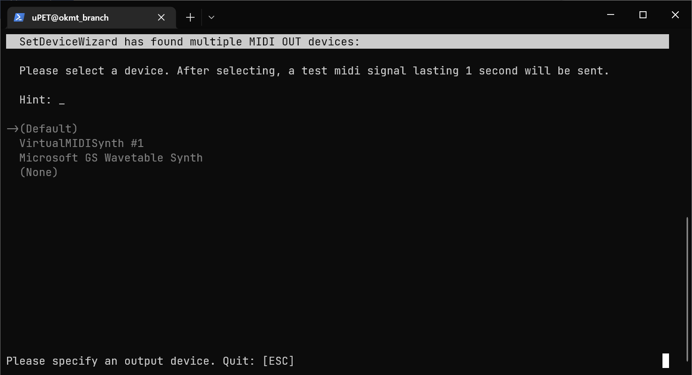
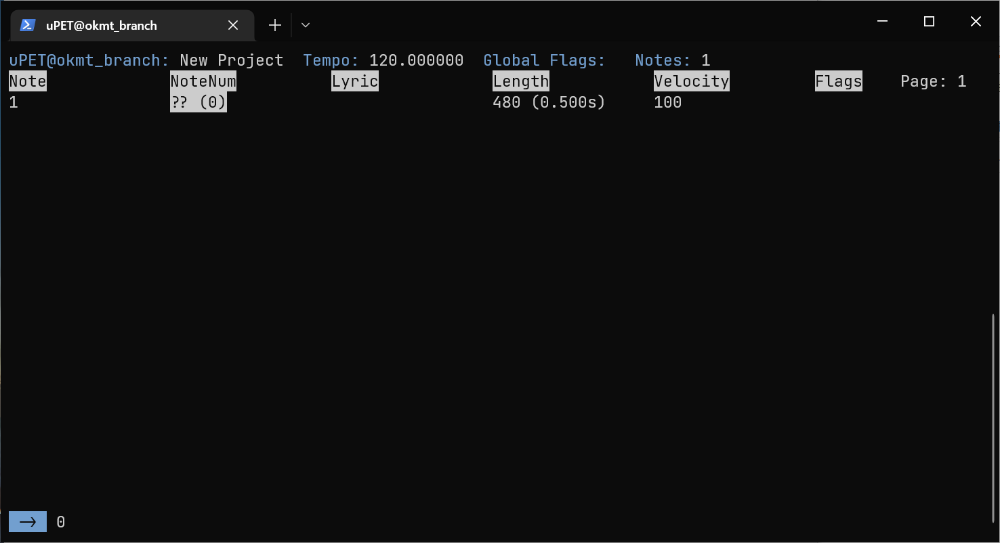
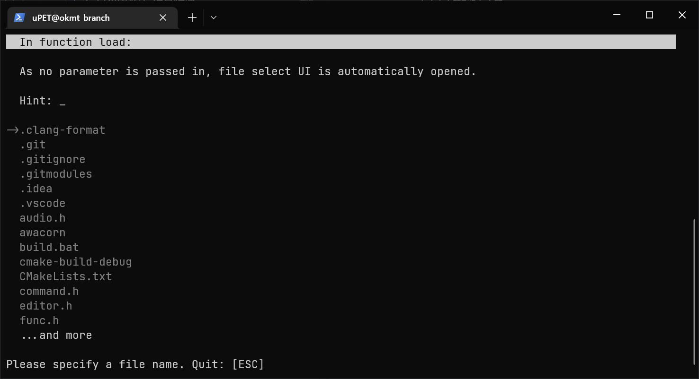
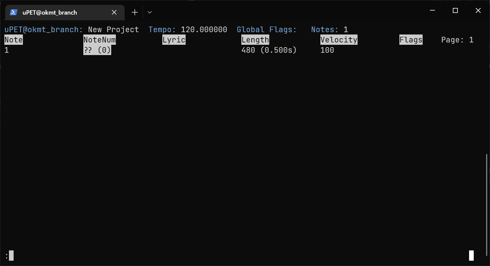

# uPET 工具使用说明书

文档作者：狼太 (ookamitai)  
代码：狼太 (ookamitai), [凌 (FurryR)](https://github.com/FurryR)  
  
项目链接: [uPET](https://github.com/ookamitai/uPET)

---

## 总体
是之前和凌一起写的项目，但是以为种种原因就分了branch来写了，**因此这里的说明只适用于`okmt_branch` (ver1a)!**

借用了凌的awacorn库，可以在[这里](https://github.com/FurryR/awacorn)进行了解！

不过是大粪山，也希望有老师阅读到了文档可以来帮帮我！

---
## UI

### SetDeviceWizard **(存在已知BUG)**

- 在打开可执行程序时，会出现`SetDeviceWizard`。

- 作用：设置MIDI OUT设备  
- 控制：  
    - 上下方向键 + 键盘输入  
    - `ESC`：退出  
- 若有困惑，请选择 `(Default)`    

### 主编辑器

- 在设置完MIDI OUT设备后，会进入到主编辑器界面。  
  （如果控制台的代码页不是932，会进行自动更换，并显示 `Your code page is not UTAU-friendly. Switched to 932`）

- 作用：编辑`UST`文件
- 控制：
    - 上下左右方向键（不在命令输入时）：切换行 / 列
    - `PAGE UP` / `PAGE DOWN`：翻页
    - `T`：Tick和时长相互转换
    - `N`：在高亮音符前插入音符
    - `M`：在高亮音符后插入音符
    - `B`：删除当前音符
    - `L`：选择，或取消选择
    - `P`：播放音符 (`Beep()`)
    - `O`：播放音符 (MIDI)
    - `I`：编辑当前单元格 ~~Excel是吧~~
    - `:`（英文冒号）：打开命令输入（`ESC`退出）
- 若有困惑，请查询上表

### 文件选择 **(存在已知BUG)**
- 当`:load`命令没有额外参数传入时，自动打开此界面。

- 作用：协助选择文件
- 控制：与`SetDeviceWizard`相同
- 若有困惑，请在`:load`命令后指定`fname`参数

---

## 命令输入
- 当数值显示区域出现`:`时，表示进入了命令输入，按下`ESC`退出

**可用命令:**
> `:q`  
 
- 作用：退出程序
- 参数：无
- 参数作用：无

> `:load [OPTIONAL: fname]`

- 作用：载入文件
- 参数：
    - 当传入了`fname`参数时：打开工程
    - 当没有传入`fname`参数时：打开文件选择UI
- 参数作用：    
    - 载入工程
  

> `:close`

- 作用：关闭工程
- 参数：无
- 参数作用：无

> `:save [OPTIONAL: fname]`

- 作用：保存文件
- 参数：
    - `fname`：欲保存到的文件名
- 参数作用：    
    - 当传入了`fname`参数时：保存打开的`UST`文件到路径
    - 当没有传入`fname`参数时：覆盖打开的`UST`文件
  
> `:play [OPTIONAL: end]`  
> `:play [end] [OPTIONAL: penalty]`

- 作用：播放工程(`Beep()`)
- 参数：
    - `end`：播放至第`end`音符
    - `penalty`：每个音符长度剪短`penalty`毫秒
    
- 参数作用：
    - 当传入了0个参数时：以`penalty`为`5ms`播放到工程结束
    - 当传入了1个参数时：以`penalty`为`5ms`播放到第`end`音符
    - 当传入了2个参数时：以`penalty`为`penalty[ms]`播放到第`end`音符 

> `:playmidi [OPTIONAL: end]`  

- **若MIDI OUT未配置，则无法使用**
- 作用：播放工程(`MIDI`)
- 参数：
    - `end`：播放至第`end`音符
- 参数作用：
    - 当传入了0个参数时：播放到工程结束
    - 当传入了1个参数时：播放到第`end`音符
  
> `:version`

- 作用：显示版本
- 参数：无
- 参数作用：无

> `:help`

- 作用：显示帮助页面（本页面）
- 参数：无
- 参数作用：无

> `:find [COL1 | COL4: /REGEX/]`  
> `:find [COL0 | COL2 | COL3: [< | <= | == | >= | >] value]` 

- 作用：匹配音符
- 参数：
    - （对于第1、4列）`/REGEX/`：用来匹配的正则表达式
    - （对于第0、2、3列）`[< | <= | == | >= | >]`：与`value`的关系
    - （对于第0、2、3列）`value`：被比较的值
- 参数作用：
    - 选中被匹配的音符

> `:sel`  
> `:selall`  
> `:desel`  
> `:revsel`  
> `:delsel`  

- 作用：
    - 选择
    - 全选音符
    - 取消选择
    - 反向选择
    - 删除选择
- 参数：无
- 参数作用：无

> `:theme [R] [G] [B]`  

- 作用：
    - 设置主题色
- 参数：`R` `G` `B`：分别设置RGB
- 参数作用：指定RGB

## TODO计划

- 加入UTAU PLUGIN兼容性
- 修复`SelectUI`的选择BUG
- 加入`TimeTravel`（撤销 / 重做）