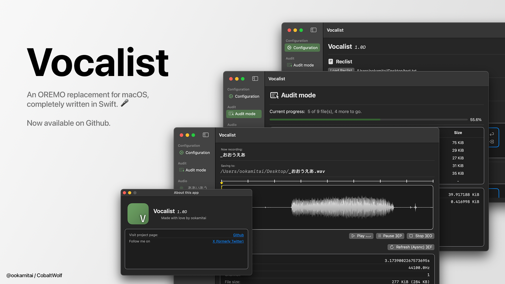
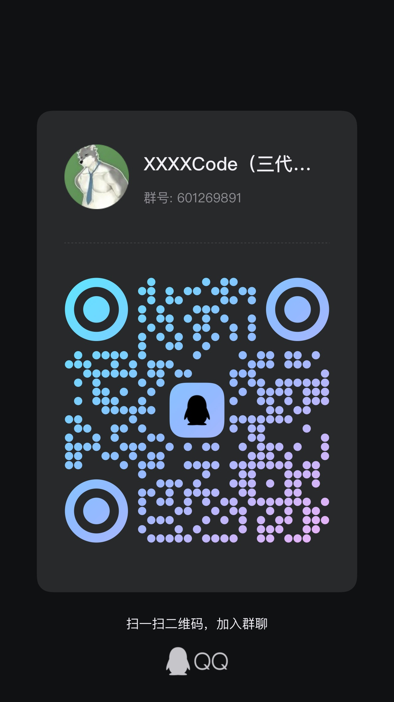
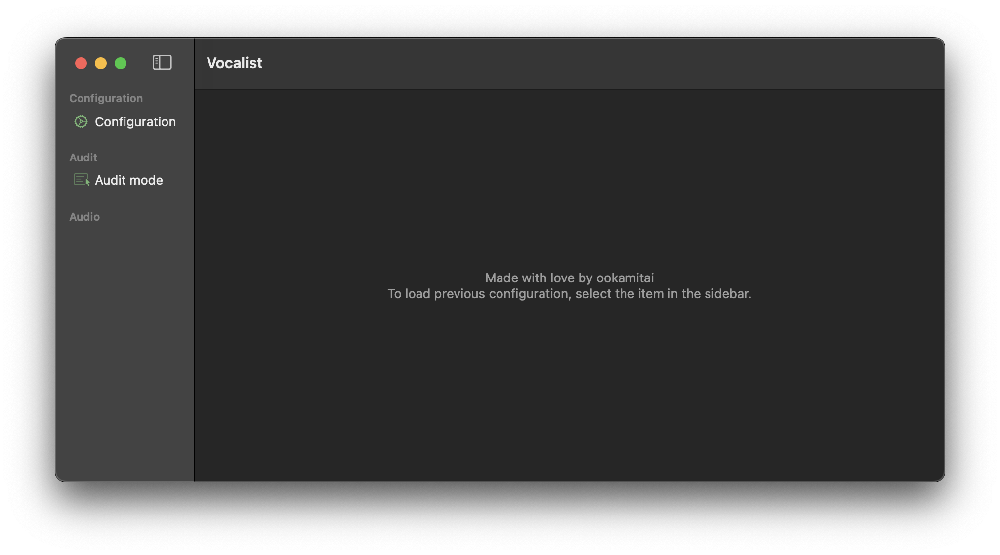
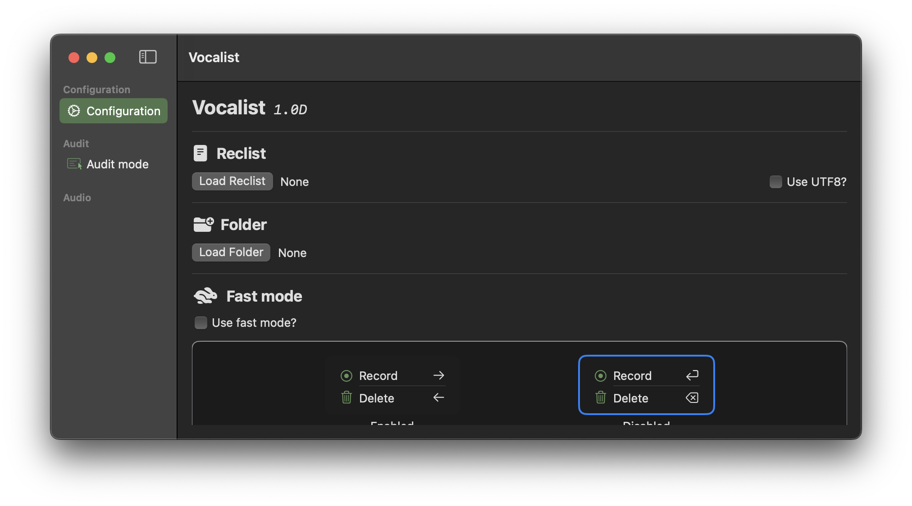
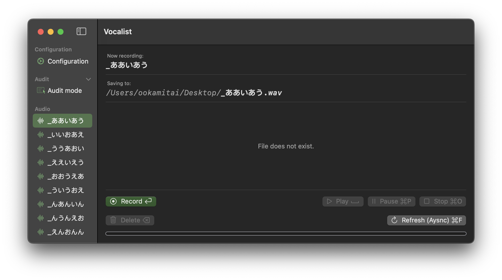
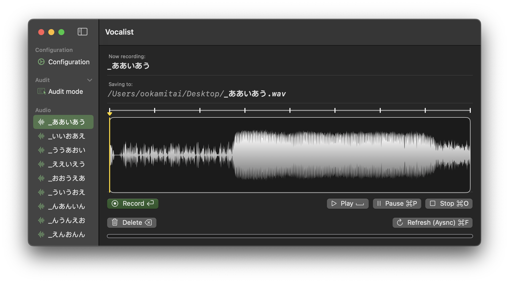
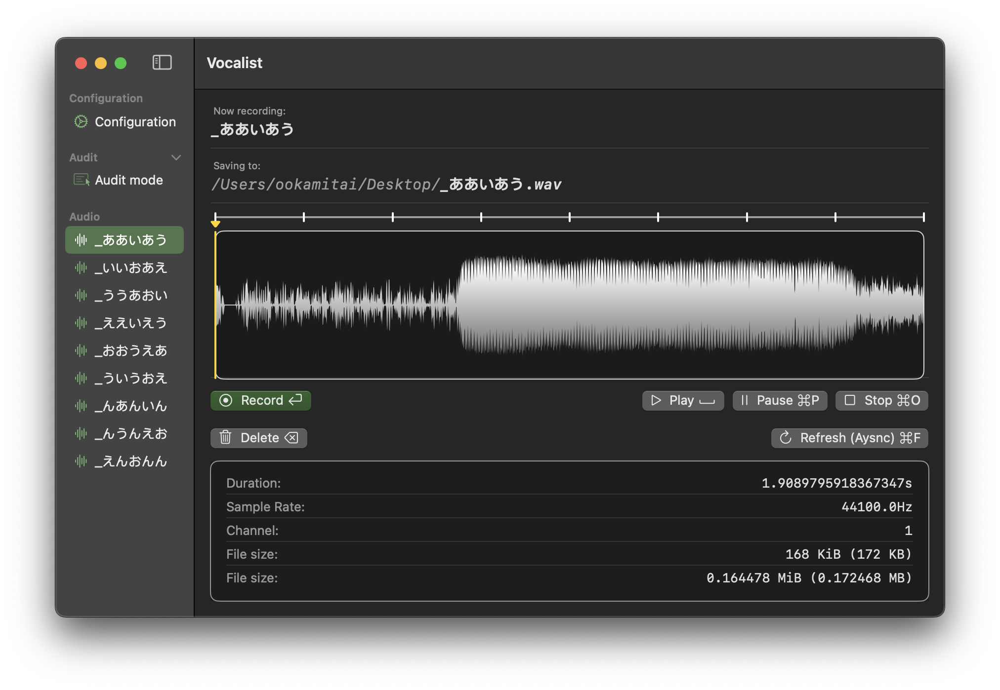
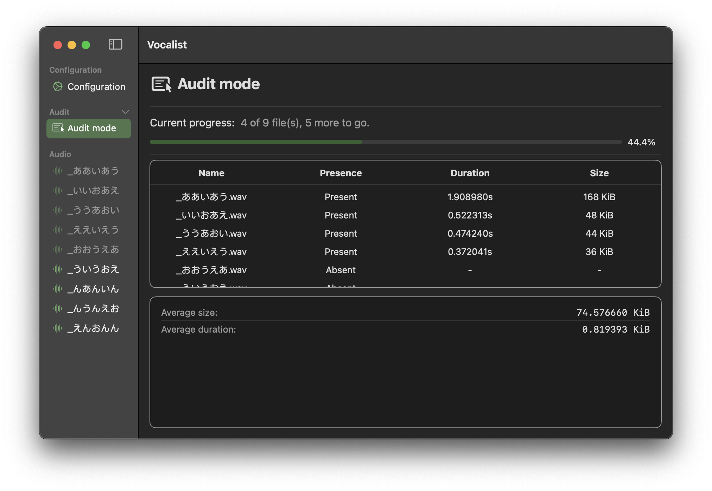
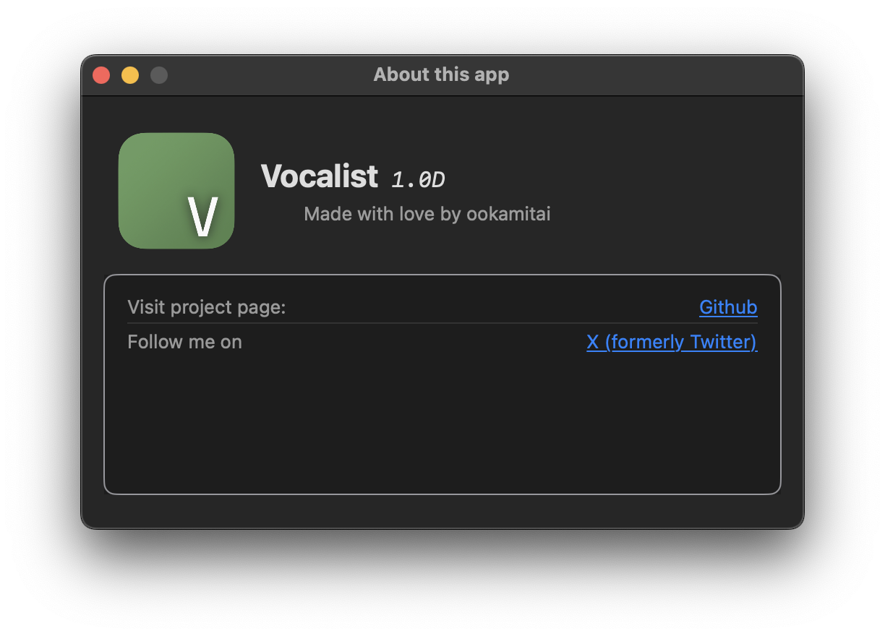

# Vocalist: Swift改写的OREMO macOS替代品

关注我的社交账号，以及star我的repo！

[工程链接](https://github.com/ookamitai/Vocalist)

## 反馈

请通过Issues，加企鹅群，或者在推特上DM我来反馈.

## 快速上手

这个工程归于 `MUGA Project` 下 (make UTAU great again).  

从 [这里](https://github.com/ookamitai/Vocalist/releases/) 下载文件.

(目前日语翻译不可用)

**注: 截图来自于版本 `1.0D`**

### 初次使用

- 当程序启动时，你会看到主窗口.

- 从侧边栏选择 `Configuration`.

- 这个面板是 **可滑动的**, 向下滑动来看更多的选项.

### 配置录音环境

- 点击 `Load Reclist` 按钮, 这回打开 `File Importer` 窗口, 选择你要使用的录音表.

- **Vocalist 默认以Shift-JIS编码加载文件. 你可以勾选 `Use UTF-8?` 勾选框来以UTF-8加载文件.**

- 点击 `Load Folder` 按钮, 选择录音文件保存的地点.

### 配置额外选项

- Fast mode

启用这个选项会将 `Record` 的快捷键从 `Return` 改为`Right arrow key`,将 `Delete` 的快捷键从 `Delete` 改为 `Left arrow key`.

- Hide recorded items

启用这个选项会使已录制的项目隐藏 ~~(有点bug)~~

- Remove UserDefaults

这会删除所有 Vocalist 保存的偏好设置.

### 录制声音

当你配置好环境后，从侧边栏选择一个在 `Audio` 区下的项目.

点击 `Record` 按钮, 或者按下文字旁边的快捷键, 来录制声音. 再次按下停止录制.

在你录制好后，更多按钮可以使用.  

- `Play (Space)`: 播放音频.
- `Pause (cmd+P)`: 暂停音频.
- `Stop (cmd+O)`: 停止播放音频.
- `Delete (Delete/Space)`: 删除音频.
- `Refresh (Async) (cmd+F)`: 刷新音频数据

你也可以调整窗口大小来看更多文件信息.

### 使用 `Audit mode` 来察看进度

当你录制好一部分后, 你可以用侧边栏的 `Audit mode` 选项切换到 `Audit mode`.

**注: 在 `Average duration: ... KiB` 中有笔误. 在 `1.0.1E` 中已修复.**

在这里你可以看到已完成多少录音、取得了多少进度以及一些常规文件信息.

### 关于这个应用

选择 `Vocalist` - `About this app` 会打开 `About` 窗口.

### 再利用以前的配置

可以重复使用以前的配置，因为 Vocalist 会自动保存它.

如果选择 `Configuration` 选项时有配置，Vocalist 会重新加载之前的配置.

## Todo
- **已完成** ~~Add `AuditView` for viewing all your audio files at once~~
- **已完成** ~~Fix `Recording` bug~~
- ~~Add spectrogram~~ 不做了.
- Add live recording waveform display
- May integrate into `Playwright`, but this will only happen when `Playwright` is partially complete.